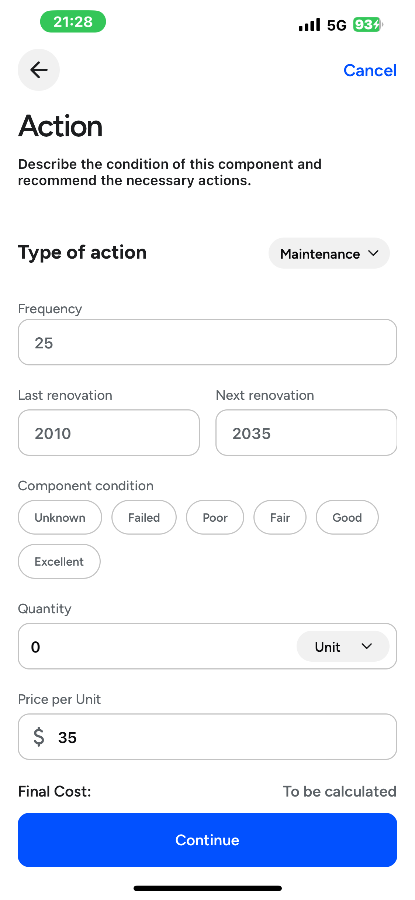

# Evalo

📱 **iOs Mobile App for streamlining the evaluation process of building**

Evalo is designed for building consulting firms which conduct building condition assessments and Reserve Fund Studies. With new regulations in British Columbia requiring Strata corporations to update Depreciation Reports every five years (starting July 1, 2024), Evalo helps streamline the entire evaluation process faster, more efficient, and compliant.

🔗 **[Landing Page & Proposal including 36-second trailer](https://www.evalo.wmdd.ca/)** 

---

## Videos
🎬 **[Trailer (36 sec)](https://langara-my.sharepoint.com/personal/hchoi38_mylangara_ca/_layouts/15/stream.aspx?id=%2Fpersonal%2Fhchoi38%5Fmylangara%5Fca%2FDocuments%2FEvalo%5Ffinal%2FLong%20Video%5Ffinal%2Emp4&referrer=StreamWebApp%2EWeb&referrerScenario=AddressBarCopied%2Eview%2Eaa75512f%2D4059%2D4990%2D8b9c%2Ded5c8b8d18d6)**  
📽️ **[Demo (about 8 min)](https://youtu.be/5J7GNhBhyaM?si=y1TGM0QPcGS25Jm1)**

---

## 📸 Screenshots

| Home Page | Building Page | Search Function | Create Building |
|-----------|---------------|-----------------|------------------|
|  |  |  |  |

| Create Building (Complete) | Building Assessment | Add Components | Description |
|--------------------------|---------------------|----------------|-------------|
|  |  |  |  |

| Add Photos | Action | Review | Review Assessment |
|------------|--------|--------|-------------------|
|  |  |  |  |

---

## 🚀 Features

### Smart Building Records
- Store and manage all building-related data (e.g., structural, financial, and historical info) in one place.

### Automated Review & Report Generation
- Notes—taking are conducted directly on a mobile device.
- Instantly generate depreciation reports that meet compliance requirements.

### AI-Powered Assessments
- AI helps you generate evaluation comments in real-time after the app converts your voice into text.
  
---

## 🧰 Tech Stack

### Frontend
- React Native
- Native Wind
- Apollo Client (GraphQL integration)
- React Native Reusables (UI components library)

### Backend
- Golang (for high performance and scalability)
- gqlgen (GraphQL server in Go)
- Microservices
  - Excel Generator
  - Pdf Generator
  - AWS Mailer
  - Image Compressor

### Database
- PostgreSQL
  
### Infrastructure
- AWS (cloud infrastructure)
- Docker (containerization with microservices)

---

## 👨‍💻 Authors

| Developer        | GitHub                                         | Role |
|------------------|------------------------------------------------|------|
| Natsuko Ogata    | [@Summer-Children](https://github.com/Summer-Children) | Frontend Developer — Implemented PDF/Excel view functionality and frontend authentication, created UI for most of the assessment flow |
| Rasul Omarov     | [@rasulomaroff](https://github.com/rasulomaroff)       | Backend Developer — |
| Tomoki Kaneko    | [@kaneko-tomoki](https://github.com/tom555-555)     | Full Stack Developer - |
| Xuehui Lan       | [@Xuehui-Lan](https://github.com/1ador)           | Frontend Developer —  |

---
| Final Report | Email | PDF Report | Budget Sheet |
|--------------|-------|------------|--------------|
|  |   |   |   |

---
